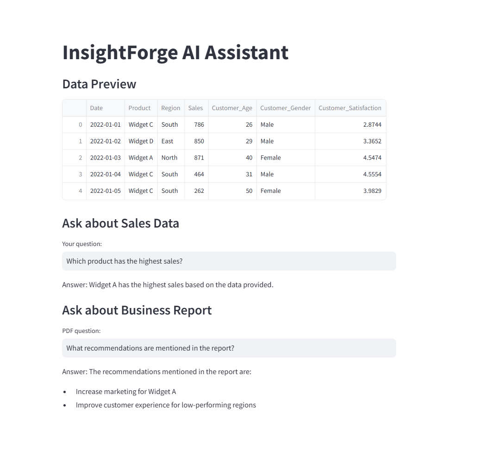

#  InsightForge: AI-Powered Business Intelligence Capstone

> AI-powered Business Intelligence system using Retrieval-Augmented Generation (RAG) to analyze structured and unstructured data

---

##  Project Overview

This project was developed as part of an AI/BI Capstone to demonstrate the real-world application of LLM-powered analytics.

InsightForge is an AI-powered Business Intelligence system that enables users to interact with business data using natural language.

The system combines:

-  Structured data (CSV sales dataset)
-  Unstructured data (business report PDF)
-  Large Language Models (LLMs)
-  Retrieval-Augmented Generation (RAG)

This solution enables organizations to make faster, smarter, and data-driven decisions.

---

##  Objectives

- Enable natural language querying of business data  
- Generate actionable insights using AI  
- Combine structured (CSV) and unstructured (PDF) data  
- Demonstrate real-world AI + BI integration  

---

##  Features

###  Data Analysis
- Sales trend analysis  
- Regional performance insights  
- Product-level evaluation  

###  AI-Powered Q&A (RAG)
- Ask business questions in plain English  
- Context-aware responses using memory  
- Multi-turn conversation capability  

###  PDF Intelligence
- Extract insights from business reports  
- Answer recommendation-based queries  
- Separate retriever for improved accuracy  

###  RAG Architecture
- Embeddings + Vector Database (FAISS)  
- Intelligent document retrieval  
- Context-grounded AI responses  

###  Additional Capabilities
-  Conversational memory for multi-turn queries  
-  Model evaluation using QAEvalChain  
-  Streamlit web application interface  

---

##  RAG Architecture Overview

This project uses a Retrieval-Augmented Generation (RAG) pipeline:

- Data is converted into embeddings using OpenAI embeddings  
- Stored in a FAISS vector database  
- Relevant context is retrieved based on user queries  
- The LLM generates answers grounded in retrieved data  

To improve accuracy, separate vector stores are used for:
- Structured data (CSV)
- Unstructured data (PDF)

---

##  Tech Stack

- Python  
- Pandas  
- Matplotlib  
- LangChain  
- OpenAI (LLMs)  
- FAISS (Vector Store)  
- Streamlit

 ---
##  Project Files

- InsightForge_Notebook.ipynb
- sales_data.csv
- business_report.pdf
- app.py
- README.md
- data_overview.png
- ai_insights.png
- pdf_qa.png
- streamlit_app.png

---

##  How to Run the Project

### Clone the repository

git clone https://github.com/penguinpia03/InsightForge-AI-BI-Capstone.git

cd InsightForge-AI-BI-Capstone
### Install dependencies
pip install pandas matplotlib langchain openai faiss-cpu streamlit
### Run the notebook
jupyter notebook
### Run all cells step-by-step.
### Run Streamlit App
streamlit run app.py
## Note

The notebook version of the project runs fully in the course lab environment.

The Streamlit UI (`app.py`) is included as part of the project implementation. In some lab environments, Streamlit may not inherit the same API-key configuration as the notebook runtime, which can affect live execution even though the notebook-based AI pipeline works correctly.

## Project Screenshots

### 📊 Data Dashboard

### 📊 AI Insights

### 📄 PDF Intelligence

### 🌐 Streamlit App

## Example Queries
Which product has the highest sales?
Why is a product performing well?
What recommendations are mentioned in the business report?
 
## Evaluation

The system is evaluated using LangChain’s QAEvalChain to compare generated answers with expected ground-truth responses.

This helps measure the accuracy and reliability of the AI system.

## Results
Accurate business insights from structured data
Context-aware AI responses using memory
Successful extraction of recommendations from PDF reports
## Future Improvements
Real-time data integration
Advanced dashboard visualizations
Deployment as a production-ready web application

## Deployment Note
The project includes a Streamlit interface in `app.py` for interactive exploration.
In the course lab environment, notebook execution and Streamlit execution may use different runtime configurations for API access. The notebook version runs fully and demonstrates the complete RAG workflow, while the Streamlit file is included as the UI implementation component of the project.
 
 ## Author
 Pia Gupta
 
 Email: contactpia@gmail.com`

