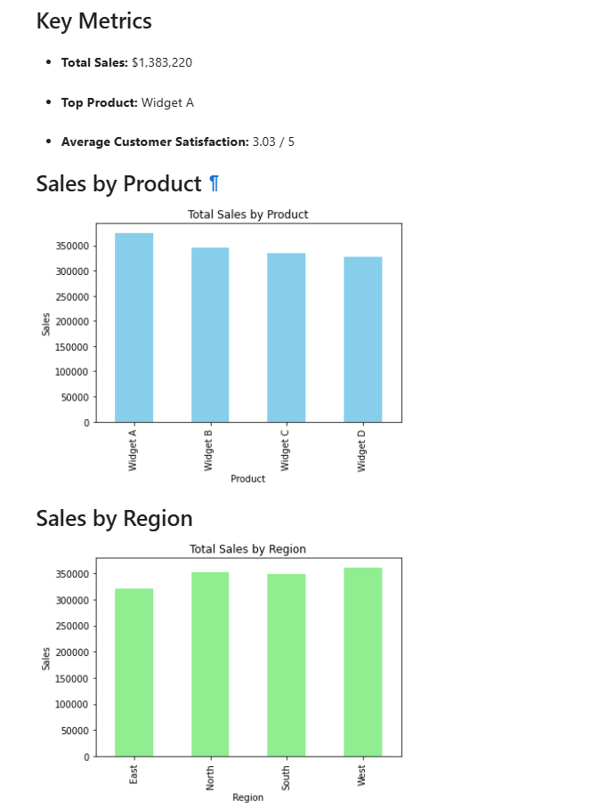
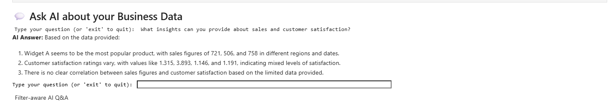
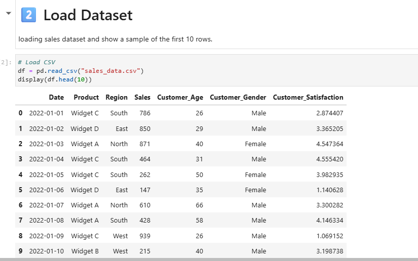
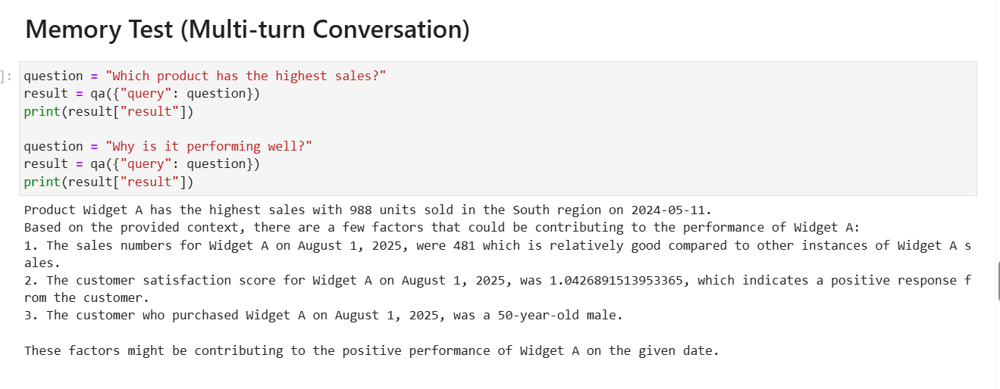

#  InsightForge: AI-Powered Business Intelligence Capstone

##  Project Overview
This project was developed as part of an AI/BI Capstone to demonstrate real-world application of LLM-powered analytics.
InsightForge is an AI-powered Business Intelligence system that enables users to interact with business data using natural language.

The project combines structured data analysis with unstructured document understanding using Large Language Models (LLMs) and Retrieval-Augmented Generation (RAG).

---

##  Objectives

* Enable natural language querying of business data
* Generate actionable insights using AI
* Combine structured (CSV) and unstructured (PDF) data
* Demonstrate real-world AI + BI integration

---

##  Key Features

###  Data Analysis

* Sales trend analysis
* Regional performance insights
* Product-level evaluation

###  AI-Powered Q&A

* Ask business questions in plain English
* Context-aware responses using memory
* Multi-turn conversation capability

###  PDF Intelligence

* Extract insights from business reports
* Answer recommendation-based queries
* Separate retriever for improved accuracy

###  RAG Architecture

* Embeddings + Vector Database (FAISS)
* Intelligent document retrieval
* Context-grounded AI responses

---

##  Tech Stack

* Python
* Pandas
* Matplotlib / Seaborn
* LangChain
* OpenAI / LLM APIs
* FAISS (Vector Store)

---

##  Project Structure

```
InsightForge-AI-BI-Capstone/
│
├── InsightForge_Notebook.ipynb
├── sales_data.csv
├── business_report.pdf
├── images/
│   ├── sales_dashboard.png
│   ├── ai_qa.png
│   └── pdf_qa.png
└── README.md
```

---

##  How to Run the Project

1. Clone the repository:

   ```bash
   git clone https://github.com/penguinpia03/InsightForge-AI-BI-Capstone.git
   cd InsightForge-AI-BI-Capstone
   ```

2. Install dependencies:

   ```bash
   pip install pandas matplotlib seaborn langchain openai faiss-cpu
   ```

3. Open the Jupyter Notebook:

   ```bash
   jupyter notebook
   ```

4. Run all cells step by step

5. Interact with the AI:

   * Ask questions about sales data
   * Ask insights from the PDF report

---
## 📸 Project Screenshots

###  Dashboard Insights



###  AI Insights



###  Data Overview



###  PDF-Based Insights




---

##  Example Queries

* Which product has the highest sales?
* Why is a product performing well?
* What recommendations are mentioned in the business report?

---

##  Architecture Overview

The system uses Retrieval-Augmented Generation (RAG):

* CSV data → Embedded and stored in vector database
* PDF data → Processed separately for accurate retrieval
* User query → Relevant context retrieved → LLM generates answer

To improve accuracy, separate vector stores were created for structured and unstructured data sources.

---

##  Results

* Accurate business insights from structured data
* Context-aware AI responses using memory
* Successful extraction of recommendations from PDF reports

---

##  Future Improvements

* Real-time data integration
* Dashboard tools (Streamlit / Power BI)
* Deployment as a web application

---

##  Author

Pia Gupta

Email: contactpia@gmail.com | 
---


